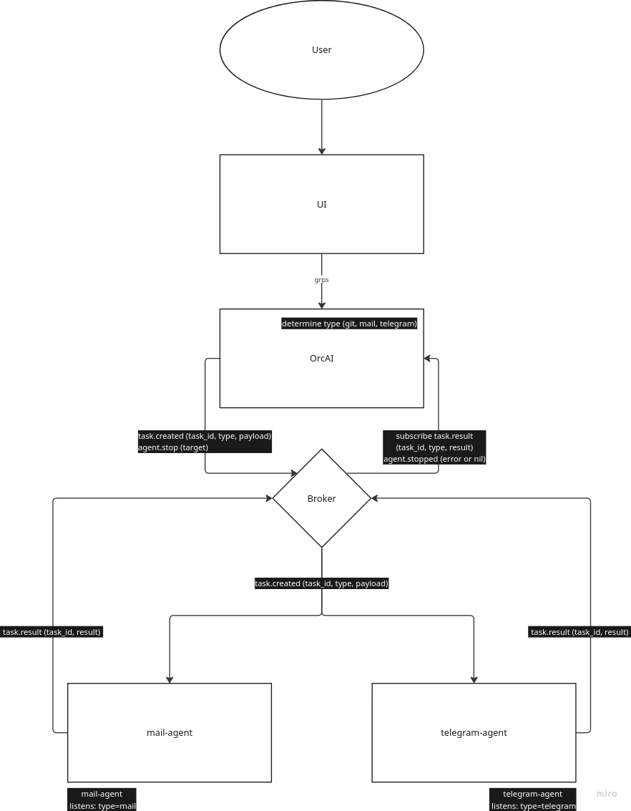

<div align="center">
  
</div>

---

## OrcAI

OrcAI is an orchestration system for running agents.

It is responsible for:

- receiving tasks  
- routing them by type  
- distributing them through a broker  
- collecting results  

Core model:

- tasks are published as `task.created`  
- agents subscribe and pick only matching `type`  
- agents return `task.logs`, `task.result`, `task.error`  

OrcAI does not execute logic itself.  
It coordinates independent workers.

---

## Work scheme



Flow:

- user / UI sends a task  
- OrcAI publishes `task.created`  
- agents consume tasks by type  
- agents execute and stream logs  
- results are published back  
- UI reads results  

---


## Philosophy

The system follows a Unix-like approach.

Each component does one thing and does it well.

- OrcAI handles orchestration  
- agents handle execution  
- Whitebox provides a minimal execution core  

There is no mixing of responsibilities.

OrcAI does not execute tasks.  
Agents do not manage routing.  
Whitebox does not add hidden logic.

This separation gives:

- simpler design  
- predictable behavior  
- easier scaling  
- easier debugging  

Each part remains small and focused.

---

## Agents in OrcAI

Any process can act as an agent.

Requirements:

- subscribe to broker  
- handle `task.created`  
- return results in expected format  

There is no restriction on language or implementation.

---

## Why use Whitebox

You can write agents from scratch.  
But most implementations become:

- heavy  
- unpredictable  
- expensive in LLM usage  

Whitebox solves this at the core level.

It provides:

- strict execution loop  
- explicit context control  
- minimal memory model  
- fixed LLM protocol  

Effect:

- lower token usage  
- predictable behavior  
- faster execution  
- lower infrastructure cost  

---

## Examples
Three simple agents in OrcAI:

### 1. Git agent

Type: `git`

Handles:

- git status  
- git add / commit  
- repository cleanup  

Input:

```json
{
  "task_id": "...",
  "type": "git",
  "payload": { "msg": "commit changes" }
}
````

---

### 2. File agent

Type: `fs`

Handles:

* read/write files
* list directories
* simple file operations

Example:

```json
{
  "task_id": "...",
  "type": "fs",
  "payload": { "msg": "read config.yaml" }
}
```

---

### 3. Code agent

Type: `code`

Handles:

* run commands
* execute scripts
* basic code tasks

Example:

```json
{
  "task_id": "...",
  "type": "code",
  "payload": { "msg": "run tests" }
}
```

---

Each agent:

* subscribes to `task.created.*`
* filters by `type`
* executes only its domain
* returns logs and result

They stay simple and isolated.


---

## Positioning

OrcAI = orchestration layer  
Whitebox = execution core  

Together:

- OrcAI routes tasks  
- Whitebox runs them efficiently  

This separation keeps the system simple and scalable.